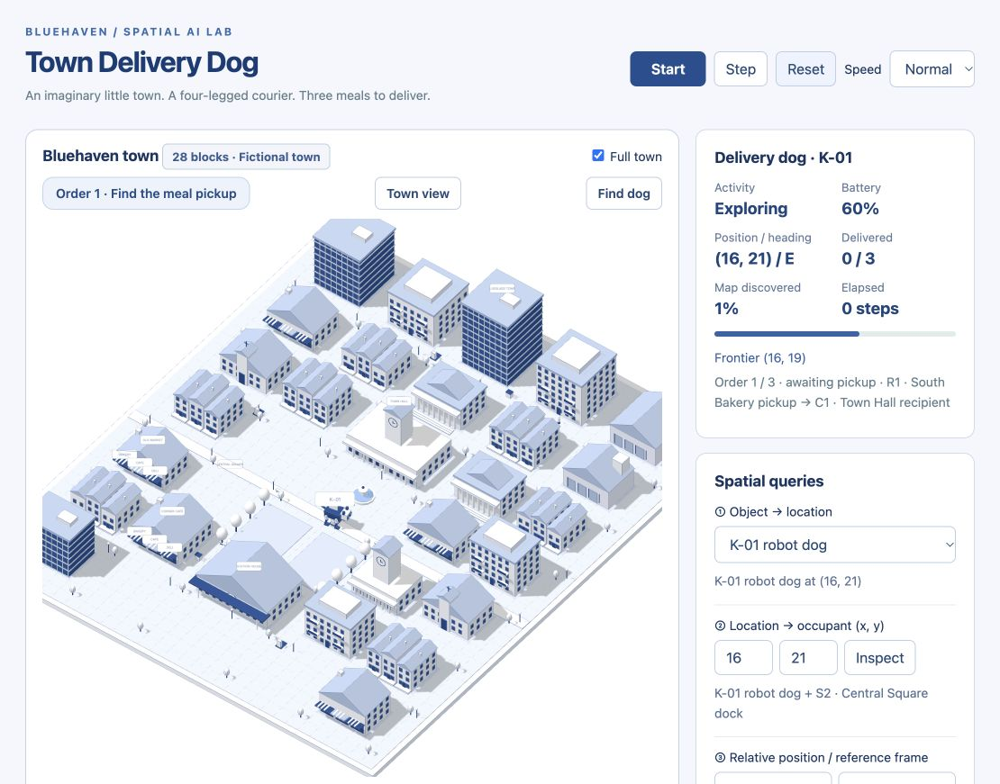

# Bluehaven Delivery Dog

An interactive 3D delivery simulation for a Spatial AI classroom. A four-legged robot explores an imaginary blue-and-white town, collects meals, delivers three orders, and returns to charging docks when its battery runs low.

**Bluehaven is fictional.** It is not a real town, an accurate geographic model, or a real robot performance model.



## Run locally

No build step, API keys, or package installation is required. Three.js is bundled locally.

From the project folder:

```sh
python3 -m http.server 8000 --directory dist
```

Open http://localhost:8000 in a browser with WebGL support. Alternatively, open `dist/index.html` directly in a browser.

## Controls

- **Start / Pause**, **Step**, and **Reset** control the simulation.
- Select Normal, Fast, or Slow speed.
- Drag to orbit, Shift-drag to pan, and scroll to zoom.
- **Find dog** follows the robot; **Town view** returns to the complete town.
- Disable **Full town** to show only the robot's discovered map.
- Click a ground cell or enter coordinates to inspect its occupancy.

## Spatial AI location requirements

| Requirement | Interaction |
| --- | --- |
| Object → location | Select the dog, a pickup, recipient, or dock to read its coordinates. |
| Location → occupant | Inspect a grid coordinate or select a ground cell. |
| Reference frames | Compare world directions with ahead/behind/left/right in the dog's frame. |
| Description → semantic region | Select “near a pickup,” recipient, or dock; matching discovered walkable cells are highlighted. |

## Simulation model

The world is a 32 × 38 grid with 28 building blocks and ten architectural types. Building footprints block movement. Paths and squares are walkable. Coordinates increase east along x and south along y.

The dog senses within Manhattan distance 2. A recognized building reveals its mapped footprint. Breadth-first search finds a shortest path through discovered walkable cells; undiscovered targets trigger frontier exploration. Each walking step costs 0.5% battery, and a charging step restores 15%. The robot reserves its known return-to-dock path length plus 14% before continuing, then charges to at least 95%. Orders are delivered in a fixed sequence, followed by complete exploration.

Semantic areas are rule-based, can overlap, and use distance ≤ 2. There is one robot and no dynamic traffic or pedestrians.

## Files

- `dist/index.html`: English interface, simulation rules, queries, and optional WebMCP tools.
- `dist/city3d.js`: Town models, lighting, robot dog animation, and camera controls.
- `dist/three.min.js`: Three.js 0.160.1, distributed under its MIT license.
- `verify.cjs`: Headless simulation checks, using Node.js built-ins.

## Verify

```sh
node verify.cjs
```

Checks order completion, full discovery, charging, battery bounds, adjacent movement, obstacle avoidance, reset, and invalid coordinate handling. It also checks the simulation tool handlers in a mock context. Rendering should be checked in a WebGL browser.

## Third-party notices

Three.js 0.160.1 is included under the MIT license. See `THIRD_PARTY_LICENSES.txt`. No Mapbox integration or token is required.
